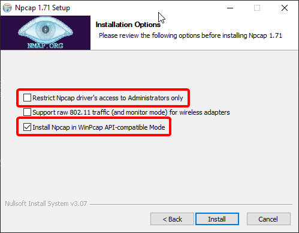

  

   
   

  
  
  

   

  

Realtime Damage Meter tool for Lost Ark

---

# Requirements

- For windows, you need [Npcap with WinPcap compatibilities](https://npcap.com/#download)
- For Unix, you need `libpcap` and `libpcap-dev/libpcap-devel` packages

### When installing Npcap for Windows:

- You must tick the case `Install Npcap in WinPcap API-compatible Mode`
- If you don't want to run loa-details as administrator every time, you should NOT TICK the case `Restrict Npcap driver's access to Administrators only`

## User Instructions

- Make you that you have installed the requirements
- Download latest release installer [here](https://github.com/lost-ark-dev/loa-details/releases/latest)
- Follow the installation instructions
- Start loa-details and start logging !

## Dev

- Clone with `git clone --recurse-submodules https://github.com/lost-ark-dev/loa-details`
- Install dependencies with `npm install`
- You can run loa-details in dev mode with the command `npm run dev`
- You can build a release-ready binary with the command `npm run build`. Output will be located in `./dist/electron` directory.

---

# Credits

This repository is a clone of the [original interface](https://github.com/karaeren/loa-details) from [@karaeren](https://github.com/karaeren).
It has been modified to work as a standalone program, without the need of any 3rd party logger.

The packet sniffing part has been made from scratch by [@Herysia](https://github.com/Herysia) and [@Mathicha](https://github.com/Mathicha), however, we can't help but thank [@Shalzuth](https://github.com/Shalzuth) for his work on [LostArkLogger](https://github.com/shalzuth/LostArkLogger).
